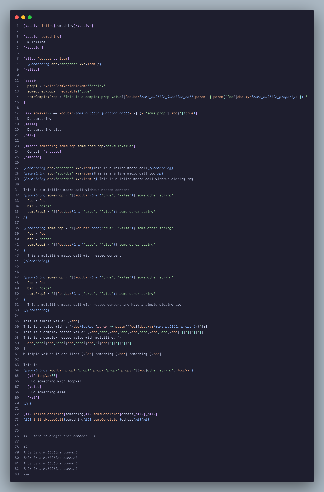

# Freemarker template language support

## Normal syntax `<>`

## Square Bracket Syntax `[]`

> [!TIP]
> Screenshots were taken with theme [Catppuccin Mocha](https://marketplace.visualstudio.com/items?itemName=Catppuccin.catppuccin-vsc)
